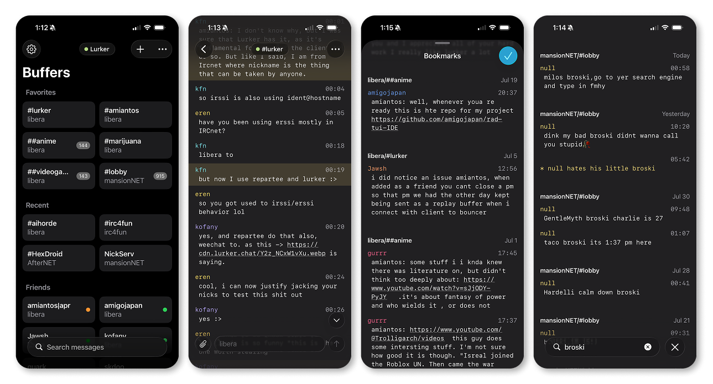

<h1>
  &nbsp;&nbsp;Lurker
</h1>

[](https://github.com/amiantos/lurker/actions/workflows/test.yml)
[](https://github.com/amiantos/lurker/pkgs/container/lurker)
[](https://codecov.io/github/amiantos/lurker)
[](https://scorecard.dev/viewer/?uri=github.com/amiantos/lurker)
[](LICENSE)
[](https://web.libera.chat/#lurker)

Lurker is a beautiful self-hosted IRC client with a retro aesthetic and modern conveniences.

# Features

- **Always-on and multi-user.** Each invited user connects to their own set of IRC networks, and Lurker stays connected when they're away. Admins can restrict which networks users can connect to, and make channel recommendations for newcomers.
- **Fully working search.** Search your message history, filter by nick, channel, or network; and jump to any message instantly, no matter how old it is.
- **Modern conveniences.** Peer presence, automatic nick regain, join/part summarization, tab nickname completion, message drafts, saved messages, user notes, inline link and media previews, and more.
- **Image uploads.** Paste an image into the input box, and Lurker optimizes it, sanitizes it, and uploads it to local storage, S3, Zipline, Chibisafe, or external services like x0.at or catbox.moe.
- **Customizable UI.** The beautiful retro terminal-style PWA interface has 40+ settings to customize it how you want.
- **Native Apps.** Lurker has official native apps [for iOS](https://github.com/amiantos/lurker-ios) (in beta) and Android (coming soon). There's also third party clients like [Spooky](https://github.com/JawshTheDark/lurker-android-upstream) (Android) and [Scully](https://github.com/JawshTheDark/scully) (PC).
- **Built-in soju-compatible bouncer.** Don't want to use the Lurker clients? Then don't. Lurker has a ZNC and soju-compatible bouncer built in, complete with `soju.im/bouncer-networks` support so you can use any client you want.

# Screenshot (PWA)


# Screenshot (iOS)



# Rave Reviews

- `<cfuser> amiantos: holy shit, you made something better than irccloud`
- `<amigojapan> great, now that amiantos's chat client is catching up to IRC cloud, I think I can switch to it as my daily driver`
- `<skdoo> amiantos makes cool shit`
- `<jadeia> lurker is really nice. this is streets ahead of irccloud in terms of design and ease of use.`
- `<helsinski> Lurker iOS is certainly shaping up to be real good.`
- `<quark> These days I am only using Lurker. Desktop and mobile.`
- `<CrashOverripe> Lurker solves most of my IRC problems - very happy you decided to take it on as more than just a solution for yourself.`
- `<Samien> Ever since I started using [Lurker], things have become so much more convenient. I can use IRC anytime, anywhere—whether at the office, at home, or on the metro—without any restrictions. and it's far way better than irc cloud`

# Installation

## Install (Docker - Recommended)

```bash
curl -O https://raw.githubusercontent.com/amiantos/lurker/main/docker-compose.yml
docker compose up -d
```

Then open <http://localhost:8015> and create your admin account. See [SELF_HOSTING.md](docs/SELF_HOSTING.md) for the full guide.

## Manual Install

```bash
npm run install:all
npm run client:build
npm start
```

## Lurker.Chat Managed Hosting

Don't want to run a server yourself? **[Lurker.Chat](https://lurker.chat)** is official managed hosting — **$5/mo**, with a 14-day money-back guarantee.

# Documentation

- [https://docs.lurker.chat](https://docs.lurker.chat)

# Community

- Chat in **#lurker** on [Libera.Chat](https://libera.chat).

# License

Mozilla Public License 2.0 — see [LICENSE](LICENSE).
